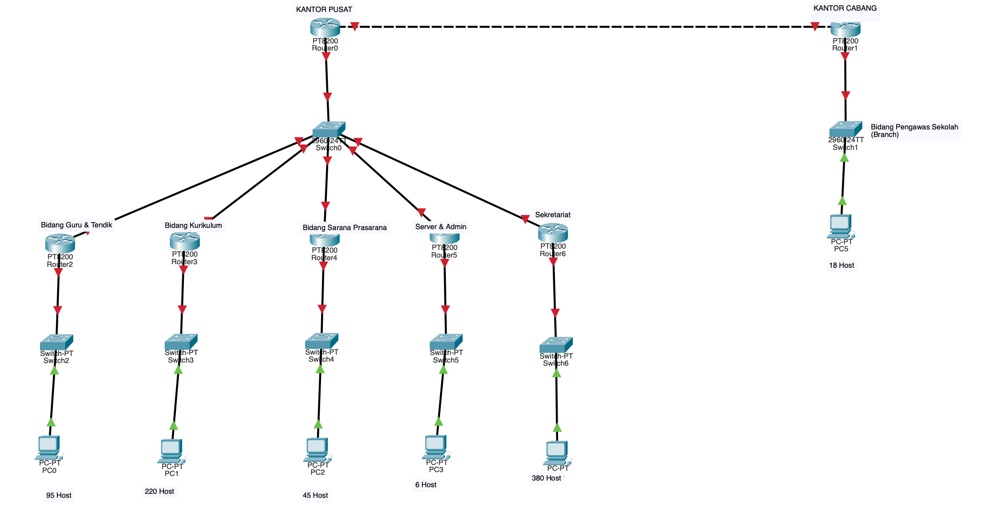

# Tugas 1 Week 11 Jarkom

|No|Nama |NRP|
|---|---|---|
|1. | Ni'mah Fauziyyah Atok | 5027241103|

# TOPOLOGI cisco

# SUBNETING

| Subnet                           | Kebutuhan Host | Netmask |
| -------------------------------- | -------------- | ------- |
| Bidang Guru & Tendik             | 95 host        | /25     |
| Bidang Kurikulum                 | 220 host       | /24     |
| Bidang Sarana Prasarana          | 45 host        | /26     |
| Bidang Pengawas Sekolah (Cabang) | 18 host        | /27     |
| Server & Admin                   | 6 host         | /28     |
| Sekretariat                      | 380 host       | /23     |
| Router Interlink                 | 6 host         | /29     |
| Tunnel/Point to point            | 2 host         | /30     |
| **TOTAL**                        | **778 host**   | **/22** |

**IP Prefix:** `10.143.0.0/22`  
Total Host: **778** host

---

## Tabel VLSM 10.143.0.0

| Subnet / Ruang          | Host Aktif (soal) | h (host bits) |       Host Usable | Network          |            Mask |  Prefix | Range Host (usable)         | Broadcast    | Gateway      |
| ----------------------- | ----------------: | ------------: | ----------------: | ---------------- | --------------: | ------: | --------------------------- | ------------ | ------------ |
| Sekretariat             |               510 |             9 | 2^9 - 2 = **510** | **10.143.0.0**   |   255.255.254.0 | **/23** | 10.143.0.1 - 10.143.1.254   | 10.143.1.255 | 10.143.0.1   |
| Bidang Kurikulum        |               220 |             8 | 2^8 - 2 = **254** | 10.143.2.0       |   255.255.255.0 | **/24** | 10.143.2.1 - 10.143.2.254   | 10.143.2.255 | 10.143.2.1   |
| Bidang Guru & Tendik    |                95 |             7 | 2^7 - 2 = **126** | 10.143.3.0       | 255.255.255.128 | **/25** | 10.143.3.1 - 10.143.3.126   | 10.143.3.127 | 10.143.3.1   |
| Bidang Sarana Prasarana |                45 |             6 |  2^6 - 2 = **62** | 10.143.3.128     | 255.255.255.192 | **/26** | 10.143.3.129 - 10.143.3.190 | 10.143.3.191 | 10.143.3.129 |
| Bidang Pengawas         |                18 |             5 |  2^5 - 2 = **30** | **10.143.3.192** | 255.255.255.224 | **/27** | 10.143.3.193 - 10.143.3.222 | 10.143.3.223 | 10.143.3.193 |
| Server & Admin          |                 6 |             3 |   2^3 - 2 = **6** | 10.143.4.0       | 255.255.255.248 | **/29** | 10.143.4.1 - 10.143.4.6     | 10.143.4.7   | 10.143.4.1   |
| Router (Interlink)      |                 6 |             3 |   2^3 - 2 = **6** | 10.143.4.8       | 255.255.255.248 | **/29** | 10.143.4.9 - 10.143.4.14    | 10.143.4.15  | 10.143.4.9   |
| Tunnel / Point-to-Point | 2 | 2 | 2^2 - 2 = **2** | 10.143.4.16 | 255.255.255.252 | **/30** | 10.143.4.17 - 10.143.4.18 | 10.143.4.19 | 10.143.4.17 |

## Tabel CIDR Agregasi – Jaringan 10.143.0.0

| Kepemilikan / Unit | Supernet / Agregasi | Subnet yang Digabung | Prefix CIDR | Mask | Range Host | Broadcast | Gateway | Keterangan |
|--------------------|---------------------|----------------------|--------------|--------|---------------------------|-------------|------------------|-------------|
| **Sekretariat** | **10.143.0.0/23** | 10.143.0.0/24 + 10.143.1.0/24 | /23 | 255.255.254.0 | 10.143.0.1 – 10.143.1.254 | 10.143.1.255 | 10.143.0.1 | Menggabungkan blok besar Sekretariat dengan 380 host |
| **Bidang Kurikulum** | **10.143.2.0/24** | 1 subnet (Kurikulum) | /24 | 255.255.255.0 | 10.143.2.1 – 10.143.2.254 | 10.143.2.255 | 10.143.2.1 | Tidak perlu agregasi, sudah blok tunggal untuk 220 host |
| **Bidang Guru & Tendik, Sarpras, Pengawas** | **10.143.3.0/24** | 10.143.3.0/25 (Guru & Tendik) + 10.143.3.128/26 (Sarpras) + 10.143.3.192/27 (Pengawas) | /24 | 255.255.255.0 | 10.143.3.1 – 10.143.3.254 | 10.143.3.255 | 10.143.3.1 | Menggabungkan Guru & Tendik (95 host), Sarpras (45 host), dan Pengawas (18 host) jadi satu supernet |
| **Server & Router (Internal)** | **10.143.4.0/28** | 10.143.4.0/29 (Server & Admin) + 10.143.4.8/29 (Router Interlink) | /28 | 255.255.255.240 | 10.143.4.1 – 10.143.4.14 | 10.143.4.15 | 10.143.4.1 | Menggabungkan subnet Server & Router Interlink di kantor pusat |

---

### Penjelasan:
- Tabel di atas disesuaikan dengan **struktur jaringan nyata di topologi Packet Tracer**.
- Setiap “Supernet / Agregasi” mewakili satu area besar yang dikelola oleh satu router utama.
- CIDR di sini digunakan untuk **meringkas beberapa subnet kecil menjadi satu entri routing** di router pusat.
- Karena semua area LAN dan server sudah jelas dipisah di topologi, **agregasi besar (/22)** tidak diperlukan.

